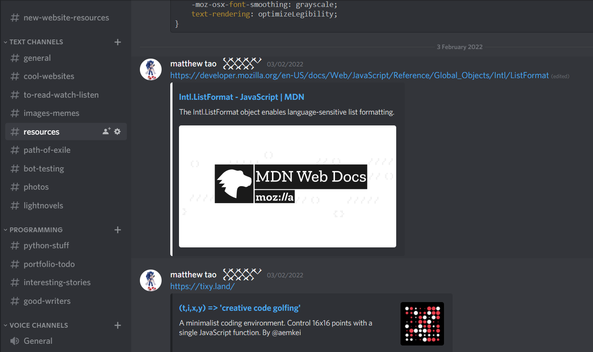
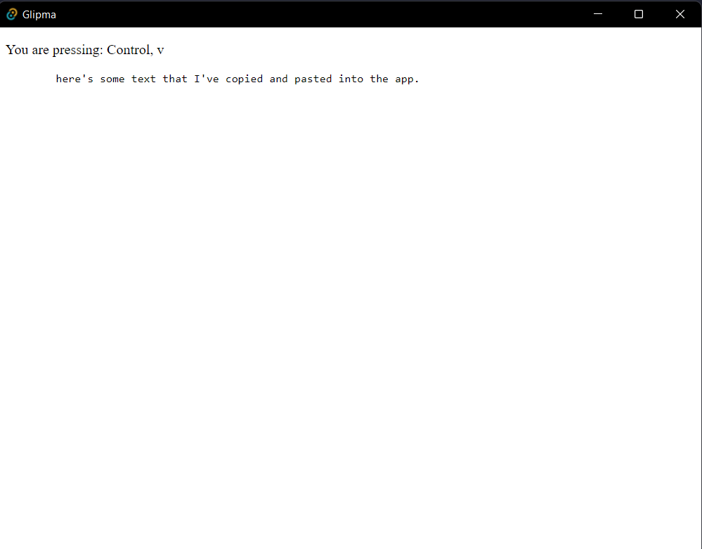

## Introduction

I'm sent a link. Opening it, a quick skim tells me that it seems to be a bafflingly [comprehensive listing of all Yo Mama](https://github.com/joshbuchea/yo-mama) jokes ever made. (Seriously! There are over 800 of them!) "I don't have a need for this," I say to myself, "but I might need it later." For me, this is quite a common experience — not being sent a list of Yo Mama jokes, but wanting to save a link or idea for later. But it's not only links that I want to save, it's:

- Images that I want to save for later.
- Snippets of code that I frequently use and forget.
- Thoughts I have at 11pm at night which I need to write down or else my brain won't let me sleep.
- Books I want to read at some point.
- Crappy jokes I think of in the shower.

And many more. In the past I've used a private Discord server to store it all, but it hasn't been the ideal solution for a few reasons.

1. The lack of a tagging system means that either I have to create a huge number of "channels," or live with larger pages, which means I have to search a bit to find what I need.

2. Again, because there's no tagging system, I can't search very easily. I'd like to be able to simply search all tagged with `CSS` and it come back with everything to do with CSS.
3.  I have to be online to access it. This is more of a peace of mind thing, it hasn't been a problem yet, but I see myself needing to check or access my notes when I'm not home. If my internet goes out, I still want access to my stuff.

## My Solution

I've decided to make my own note keeping/clipboard manager desktop app. I'll be using Svelte and Tauri to make it. I chose Svelte because it's a very performant and slim framework, and provides an amazing developer experience. Tauri is an alternative to Electron, and is something I'm testing, I've heard good things about it such as being much slimmer in bundle size and memory usage compared to Electron, and I'm excited to test it out! I've (tentatively) decided to call my app Glipma, short for Great cLIPboard MAnager.

### Main Features

- Persistant data storage, can access offline.
- Tagging system, where you can filter by tags.
- Search functionality.
- Categories.
- A visually appealing design. (Not sure what direction I'll take it at this point)

## The progress so far

I'll be documenting my progress though these devlogs and explain some of the decisions I make along the way.

To set up the Tauri project with SvelteKit, I followed [this guide](https://medium.com/@cazanator/tauri-with-standard-svelte-or-sveltekit-ad7f103c37e7) by Dan Casler.

So far, after only around 30 minutes, I've implemented a core functionality: pasting.

```html
<script>
	import { readText } from '@tauri-apps/api/clipboard';

	let clipboardText;

	let pressedKeys = [];

	const handleKeydown = (e) => {
		// only add new keys
		if (pressedKeys.includes(e.key)) {
			return;
		}

		pressedKeys = [...pressedKeys, e.key];

		if (pressedKeys.includes('Control') && pressedKeys.includes('v')) {
			readText().then((text) => {
				clipboardText = text;
			});
		}
	};

	// remove keys when they're released
	const handleKeyup = (e) => {
		pressedKeys = pressedKeys.filter((key) => key !== e.key);
	};
</script>

<svelte:window on:keydown={handleKeydown} on:keyup={handleKeyup} />

<p>You are pressing: {pressedKeys.join(', ')}</p>

<pre>{clipboardText}</pre>

```

And here's what that looks like.



That's all for now! You can check out the source code [here](https://github.com/matthewyingtao/Glipma). Stay tuned for more updates!