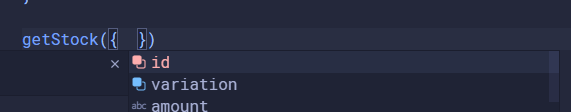

## Introduction — what is object destructuring?

At it’s core, object destructuring is a syntax that allows you to extract values from an object and assign them to variable names.

```jsx
const favoriteFruit = {
  name: "apple",
  color: "red",
}

const name = favoriteFruit.name
const color = favoriteFruit.color

// is equivalent to
const { name, color } = favoriteFruit
```

How I like to think about it is that we’re stripping the properties we need from the object. But aside from being slightly more consise, why is destructuring useful? For that we need a more practical example.

## A real world example

```jsx
const item = {
  id: 1234,
  name: "Metal Bottle",
  variation: "red",
  price: {
    currency: "NZD",
    amount: 15.0,
    tax: 0.15,
  },
}
```

Here we have an item object that has a bunch of properties. Say we need to define a function that takes the id and variation properties from the item and return the stock numbers.

```jsx
function getStock(item) {
  const id = item.id
  const variation = item.variation
  // make a fetch request to some API using the id and variation

  return stock
}

getStock(item)
```

Here’s an example of how that would be accomplished without object destructuring. To contrast, here’s how the same functionality would be accomplished with object destructuring.

```jsx
function getStock({ id, variation }) {
  console.log(id) // 1234
  // make a fetch request to some API using the id and variation

  return stock
}

getStock(item)
```

What this does is take the `item` object we’ve passed in, finds the `id` and `variation` properties on it and finally assigns them to variables named `id` and `variation`.

We can immediately see a few benefits:

1. The properties used in the function are made obvious.
2. Primitive properties are copied when you use destructuring, which helps to prevent side effects.
3. VSCode (and probably other code editors) autocompletion can help you when calling the function.



Number two might be a little confusing to newer programmers and those unfamilliar with JavaScript. Firstly, what is a primitive? A primitive in JavaScript is defined as [data that is not an object and has no methods.](https://developer.mozilla.org/en-US/docs/Glossary/Primitive#:~:text=data%20that%20is%20not%20an%20object%20and%20has%20no%20methods.) This includes strings, numbers and booleans.

<aside>
You may be confused as to why these aren’t objects, as you can call a method such as the `.toString()` method on a number. This is because under the hood, JavaScript wraps the primitive, converting it to an object, calls the method and finally destroys the wrapper.
</aside>

Another term that may be unfamilliar is side effects. A function with side effects is one that uses or changes a variable outside it’s scope. Or put simply, what you pass as the function’s arguments is all it should interact with. So what does that look like in practice?

```jsx
console.log(item.name) // "Metal Bottle"

function prepareItemForCheckout(item) {
  // Processes the item data for checkout.
  item.name = `${item.name} (${item.variation})`
  return
}

prepareItemForCheckout(item)

console.log(item.name) // "Metal Bottle (red)"
```

As you can see, we’re modifying the item’s name inside the function, which affects the `item` variable in the global scope. Now your rendering logic for your UI may now be broken in subtle or not so subtle ways. In `prepareItemForCheckout` I could have changed the `name` property to a `list`, and maybe somewhere else in my code, it relies on `name` to have the `.toUpper()` method.

Lets take a look at a more complex example.

```jsx
function computeTotalPrice({
  item: {
    price: { amount, tax },
  },
  firstTimeDiscount = false,
}) {
  const priceWithTax = amount * tax

  if (firstTimeDiscount) {
    return priceWithTax * 0.9
  }

  return priceWithTax
}

console.log(computeTotalPrice({ item, firstTimeDiscount: true })) // 15.525
```

Here we have a function that uses object destructuring with an optional argument, `firstTimeDiscount` set to false by default. It finds the item property on the object, and finds the `price` property on it. Finally, it declares the variables `amount` and `tax`. Note that you can’t access `item` and `price` as variables within the local scope.

I’d like to draw attention to the function call. What would it look like without object destructuring?

```jsx
// with object destructuring
computeTotalPrice({ item, firstTimeDiscount: true })
//without
computeTotalPrice(item, true)
```

What’s `true`? It’s impossible to tell how that argument is being used by the function without looking at the function definition itself. With object destructuring, the purpose is crystal clear.

## Conclusion

To reiterate, object destructuring in JavaScript is useful because it:

1. Makes the properties used in a function more obvious.
2. Makes function calls more readable by providing context such as `firstTimeDiscount: true`
3. Helps to prevent side effects.
4. Enables code editors to give more helpful suggestions.

Thanks for reading! 👋
