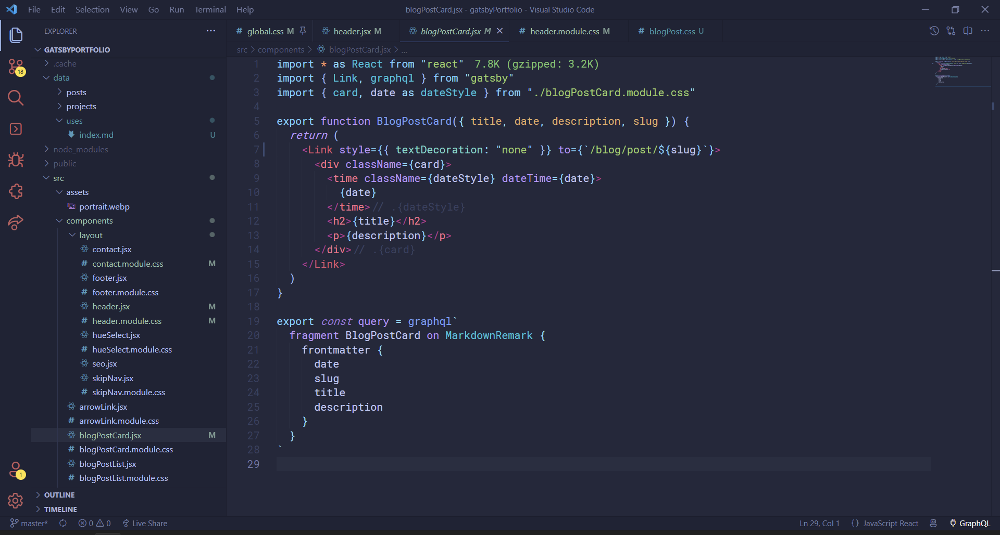

# <em>/</em>Uses
Inspired by [Wes Bos](https://wesbos.com/)' [uses.tech](https://uses.tech/), here is a list of things I use on a daily basis that help me code.
## Software and Tools
- I use **Visual Studio Code** as my code editor of choice with the [Tokyo Night Storm](https://marketplace.visualstudio.com/items?itemName=enkia.tokyo-night) theme and the [Fluent Icons](https://marketplace.visualstudio.com/items?itemName=miguelsolorio.fluent-icons) extension. The font I use is Roboto Mono. Here's what that looks like:

- I use **Figma** to prototype and iterate my website and app designs, as well as to create simple SVG files (I use **Adobe Illustrator** for anything more complex). 
- **[Squoosh](https://squoosh.app/)** is an amazing web app I often use to compress images.

## Hardware
- Laptop — ASUS Vivobook Pro 15 OLED M3500QC
- Keyboard — Logitech G815 LIGHTSYNC
- Mouse — Logitech G402 
- Headset — HyperX Cloud Stinger Core
